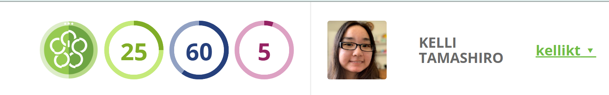

When I first came into the ICS program at UH Manoa, I remember one of my friends mentioning the “levels” that you can get as you progress through your ICS career. He proudly showed me his Level 2 RadGrad sticker, urging me to go and get my sticker too. I did get my sticker. However, it was more than just something that I would stick on my laptop as decoration. It made me realize how much more there was to this ICS program, and how it’s not just about the courses you take, but also about the experiences in the field that you go through. 

RadGrad emphasizes this by using a game system that rewards students with levels as they not only complete courses, but also complete various experiences, such as HACC, CCDC, ICPC, and internships. Ideally, this level system helps motivate students to participate in more than just their classes, but also partake in outside opportunities related to computer science. I most recently leveled up from Level 2 to Level 3, so I will go through some of the different aspects of RadGrad that I noticed while leveling up.

## Degree Planning, a Breeze with RadGrad!

While going through the process of leveling-up, I noticed numerous parts of RadGrad that I loved. The interface of the Degree Planner felt very light, the click-and-drag interface made it easy to organize my plans for the school year. I also liked parts of the interface of the Explorer, it was easy to see which ICE points each opportunity provided and the tags/brief description gave me an initial idea of what the opportunity was about. In addition, I just wanted to note that the documentation for each page was very extensive, I felt that it was well-written and gave me a good idea of what I could do on each page. 

I also found a few features of RadGrad that I had not noticed before. Admittedly, I had only used the Explorer to search for opportunities, so I didn’t realize how many options there were in the explorer, especially the ability to find other users (or just the users who had opted to share their information). I was hoping for the ability to see the opportunities/courses that they had completed, so that if they had similar interests to mine, I could also look through their opportunities and perhaps add some of those my degree planner as well. However, it is understandable if it was not added due to privacy concerns - but maybe if users consent to having this information be displayed to other users, it could be a future addition to RadGrad. 

Another feature that I discovered was the ability to search by interest. I felt that this was another very useful option, as it gives users the ability to find both courses and opportunities based on a particular topic/field of interest. This would be especially helpful for users who are interested in just a few fields in computer science, as it gives a consolidated list of options that they can pursue for their interest.

Lastly, I also noticed the recommended courses/opportunities on the user RadGrad homepage. I think that these are mainly content-based recommendations, as all of the recommended courses/opportunities seemed to have an interest that I had favorited previously. While content-based recommendations are great, I wonder if there is also room for collaboration-based recommendations, where opportunities/courses from users who have similar interests to me (or who have taken similar opportunities) will also be recommended. 

## RadGrad Wishlist

However, even with all the good that RadGrad offers, there are still a few things that I would want to add to RadGrad. One would be a couple of changes to the Degree Planner/Explorer. I understand the underlying idea of having students actively look at the opportunities they’re adding to their Degree Planner by using the Explorer - but I wonder if there is a way to integrate a smaller version of the Explorer into the Degree Planner. Perhaps instead of being able to add only favorites into the Degree Planner, it would be useful to have a pop-up version of the Explorer within the Degree Planner. This pop-up Explorer would only have the option to find opportunities using the Opportunities/Interests option in the regular Explorer, but would provide users with an option to find and add opportunities to their degree plan, just in one page. As an example of this, it would be similar to the option to search for courses when you click on a course in your course plan in STAR. 

Another addition that I would want to add, although I’m not sure if it’s possible, would be to pull planned courses (courses for the future in course plan) from STAR and add that to the Degree Planner. This might mainly just be personal preference, as I plan most of my courses within STAR, but I think that if possible, this would be very helpful, as instead of updating two course plans, users would only need to update one. 

This is also maybe a high-reach wish, but it would also be very helpful if there were suggestions on how to prepare for a particular opportunity/course. For example, for an opportunity like “Global Game Jam”, some of the suggestions could be to do the “Learn Unity” opportunity or the “ACM Manoa” opportunity (for the Game Dev SIG). However, I’m not sure how RadGrad would be able to implement this, as these suggestions would likely need to be entered manually, since the suggestions for each opportunity would be based on different factors (if it requires a certain skill set, if going through another, easier, opportunity might prepare you for a more difficult opportunity).

## But RadGrad is not bad!

Overall, I felt that while there are some stretch improvements that could be made to RadGrad, the system itself has a nice, functional design that can help students plan out their ICS career, both in-and-out of school. It’s certainly something that can be used to empower students and help them feel that the ICS program is not just a list of classes to check off, but experiences that they can and should get involved in as well.
