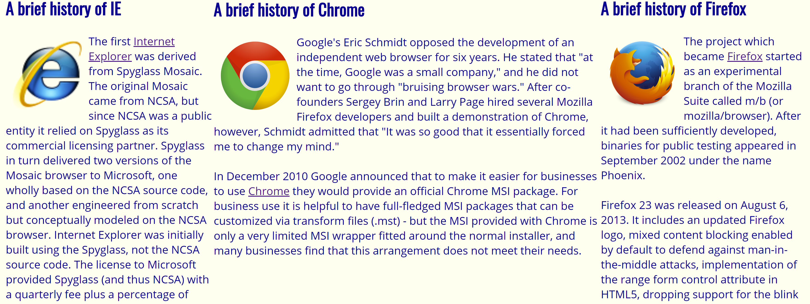
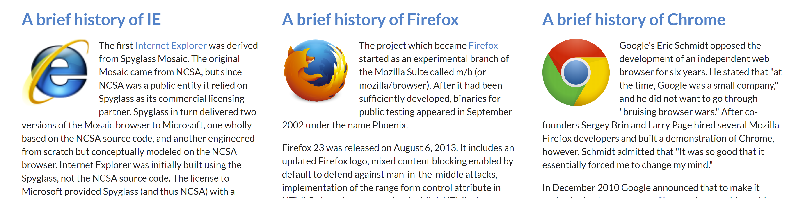

Working through a formatting practice exercise in HTML and CSS, I encountered what would become my enemy of the day, the dreaded three columns of my webpage. The left and right columns were easy enough, just floating the sections in the appropriate directions seemed to format it well enough. The middle column proved much more trickier. Squeezing it between my two other columns, I found difficulty no matter how much I fiddled with it. The height would be too tall, the width would be too big - it just didn’t look consistent with the other two columns. There had to be a better way to format it. As it turns out, there is, in the form of Semantic UI. Semantic UI is a UI Framework, which provides CSS classes and JavaScript functions that help simplify front-end workflow and provide aesthetic, consistent website layouts throughout all browsers. Essentially, it cuts down the level of work for front-end development. That being said, is it really necessary to use UI Frameworks for software engineering?

## UI Semantics is another word for shortcut



One of the biggest benefits of using a UI Framework like UI Semantics is the time you save for formatting. Menus, buttons, columns, and even images have custom classes that can give your website a sleek, modern look. As an example, here’s the HTML/CSS code I used for the columns in my webpage without Semantic UI:

HTML:
```
<div class = "left">
...
</div>
<div class = "right">
...
</div>
<div class = "center">
...
</div>
```

CSS:
```
.left {
  float: left;
  width: 300px;
  padding: 1em;
}
.right {
  float: right;
  width: 300px;
  padding: 1em;
}
.center {
  margin-left: 300px;
  margin-right: 300px;
  padding: 1em;
}
```
Here’s the HTML/CSS code I used with Semantic UI:

HTML:
```
<div class="ui equal width grid">
    <div class="ui column">
    ...
    </div>
    <div class="ui column">
    ...
    </div>
    <div class="ui column">
    ...
    </div>
</div>
```
CSS:
None (besides pre-built Semantic UI classes)

Compared to raw HTML/CSS, Semantic UI does not require any user-created custom classes for the columns in the webpage. With custom classes, users not only have to specify the width of each of the columns, they also need to play around with the padding and margins to create equal space between the column. As such, these built-in classes are a huge time-saver when it comes to giving basic functionality, such as evenly spaced columns, to your website. 

Furthermore, Semantic UI gives your website a more responsive UI. Without putting precautions in place for custom classes, using a smaller sized screen, such as viewing the website with a smartphone or tablet, will glitch the interface, and sometimes cause elements to fall upon each other. Semantic UI's built-in classes are responsive by default, so users don't have to worry about the readability of their website with different sized screens.

While one tradeoff for built-in classes with Semantic UI is that sometimes it can feel a little limited in terms of customization, it is still possible to edit the CSS, giving users the opportunity to shape elements of their websites into something more of their liking. As such, users can focus more on the overall layout of their website, rather than the implementation of common elements like menus. This allows users to give more thought into the flow of their website, such as where to place elements so they’re more intuitive and appealing to customers.

## But don’t just focus on the semantics


However, using Semantic UI doesn’t mean that your website will automatically be up to par with modern-day web design. Studying the design of other websites and incorporating parts that seem appealing to you are a big part of building up skills in web design. Yet, Semantic UI is still a great tool to help improve upon this skillset.

Using the built-in classes with Semantic UI, it is easy to replicate the likeness of other websites. In an exercise using Semantic UI, I attempted to rebuild the homepage of Kealopiko, a clothing brand website. Rebuilding this website really gave me a better understanding of how to better utilize both Semantic UI classes and custom CSS classes to achieve my intended result. Most importantly, I gained more experience in altering the pre-built Semantic UI classes to better fit my needs, for example, the navigation menu:

HTML:
```
<div class="ui fitted borderless navbar menu">
  ...
</div>
```

CSS:
```
.ui.borderless.navbar.menu {
  box-shadow: none;
  border: none;
}
```

Although the regular Semantic UI menu class comes with a box shadow and border, I was able to alter the menu to achieve a sleeker look that fit in with the rest of the website. Perhaps a good analogy for pre-built Semantic UI classes and custom CSS classes would be a hammer and a chisel. The pre-built classes are used to quickly mold the foundation of the website, like the functionality of a menu, while the custom CSS helps to bring more detail into the design, like the font-family and look of the menu. Using one is good, but using both is powerful.

## So is it worth it?

UI Frameworks gives a multitude of benefits to software engineering, from quickly developing website prototypes to replicating existing designs for further study. With all of its in-built classes, using a UI Framework is a powerful tool to utilize for front-end development along with existing CSS knowledge. However, depending solely upon a UI Framework like Semantic UI limits what you can create in front-end development. As such, using a UI Framework will only be as powerful as the existing knowledge possessed by the user. Use it, but don’t completely rely on it.
