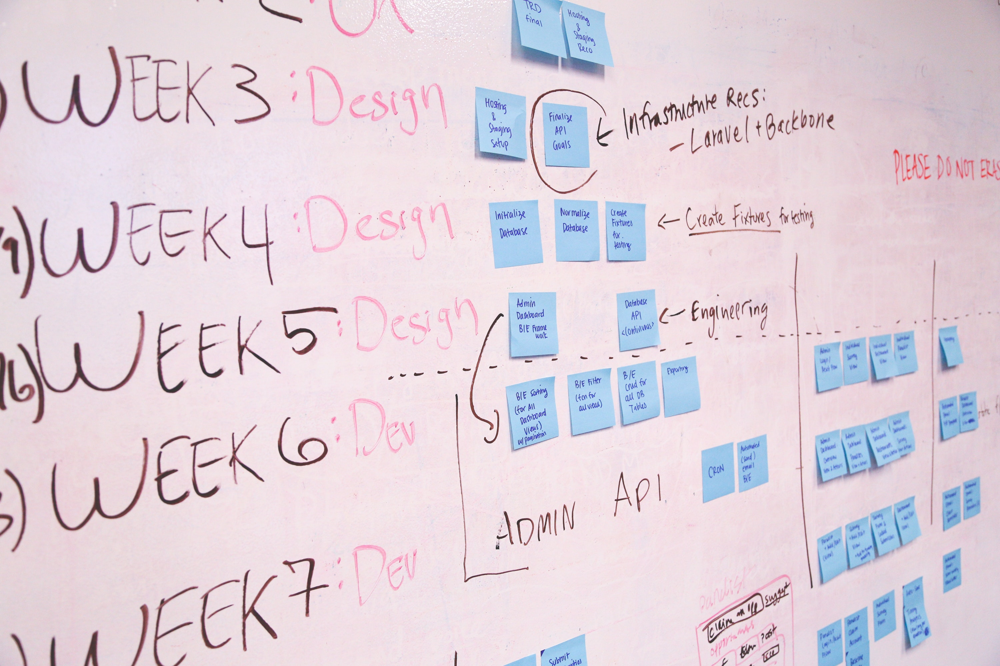

Throughout this semester in ICS 314 Software Engineering, I have learned about many different topics regarding web development, such as Agile Project Management and Ethics in Software Engineering. However, while extremely useful and important in software development, these topics can also be applied to projects outside of web applications.  

## Agile Project Management - What is it?

Agile Project Management is a lightweight form of project management that focuses on being responsive to customer feedback and open towards rapid change that addresses this feedback. Some of the key features of Agile Project Management are that each release has a fixed deadline, each release delivers functionality, and detailed planning is only done short-term. When my team and I worked on our UHM Food Mood website, we used Issue Driven Project Management, a form of Agile Project Management. Issue Driven Project Management essentially divides the project into a series of milestones, and within those milestones, a number of tasks to complete. Here are some key aspects of Issue Driven Project Management: there are always tasks for each member to work on, every member knows what task to work on, every member knows which task to work on after they finish their current task, no task is reliant on the completion of another task, each task contributes to the completion of the overall project, each member knows the state of the project, and each member can recognize breakdowns in the project. For UHM Food Mood, we used GitHub’s project boards, automated kanban boards, to apply Issue Driven Project Management to our project process. 

By using the automated kanban boards, members can see exactly what they need to work on (GitHub issues) and progress towards completion of the project as a whole. It is a relatively straightforward process that efficiently divides work among team members.

## Can Video Production be Agile? Should it?

However, Issue Driven Project Management can be used for fields other than web applications and software development as a whole. A couple of years ago, I had an internship at a video production company that produced wedding videos for their customers. As such, I believe that Issue Driven Project Management could also be applied to the process of producing videos, as the size of the team tended to be on the smaller side, from 2 to 4 people, and both video production and software development provide a concrete deliverable to the consumer. However, in this case, rather than using GitHub project boards and issues, utilizing some type of program with a kanban board, such as <a href="https://www.meistertask.com/">MeisterTask</a>, would be better suited for this type of project. Regarding the project process of a wedding video production, the project could be divided into a few milestones. 

## Milestones and more

In the first milestone, I would expect all filming and photography for the wedding to be completed. This could be broken down into a few tasks, where different team members would be responsible for filming/photographing different parts of the wedding. Some example tasks would be: photographing the bride/groom, filming the ceremony in a wide angle, filming the reception in a wide angle, filming the ceremony with a close-up of the bride, filming the reception with a close-up of the groom, and adjusting the colors of the raw footage. Of course, there would be more tasks that film different angles/shots of the wedding, but the important thing to note is that none of these tasks are dependent on each other. At the end of this milestone, the concrete deliverable would be the footage for the customer to review/give feedback on. Based on this feedback, the team would be able to create tasks for their next milestone, which would essentially be the first draft of the wedding video.

The next milestone, the first draft of the wedding video, can also be broken up into tasks such as: editing the ceremony video, editing the reception video, and editing the wedding photographs. Like the first milestone, none of these tasks are dependent upon each other. However, perhaps the first two tasks could be broken up into subtasks, such as syncing the audio/video of different angles of the ceremony/reception and adjusting the colors of the raw footage. This milestone would have a fixed deadline of around a week. At the end of this milestone, the customer would be able to provide feedback on the first draft of the wedding video, which can be used for the next milestone.

From this point on, each milestone should mimic the same structure of the second milestone, mainly having members work on tasks such as editing the ceremony/reception videos and the wedding photographs based on feedback from the customer. Each milestone would also have a deadline of about a week. More milestones should be developed until the customer is satisfied with the videos and photographs. 

As such, Agile Project Management can and often should be utilized for projects beyond those in software development, as long as there is some type of concrete deliverable given to the consumer. It streamlines the project process by providing an efficient way to both view project process and split up the project to be more manageable. 

## Ethics, how important is it?

We were also taught the basics of ethics in software engineering, where we primarily went over the necessity of using a code of ethics as a software developer. To give an idea of some of these ethics, here are a few from the <a href="https://www.acm.org/code-of-ethics">Association for Computing Machinery Code of Ethics</a>: “Contribute to society and to human well-being, acknowledging that all people are stakeholders in computing”; “Avoid harm”; “Be honest and trustworthy”; “Strive to achieve high quality in both the processes and products of professional work”. One of the main reasons why it is necessary for software engineering in particular to have a code of ethics is due to the amount of power that software developers possess in regards to the applications they are building, such as the ability to track user data or otherwise violate user privacy. For our class, we utilized the code of ethics to debate whether it is morally right to delete Facebook, in part due to privacy concerns with <a href="https://www.nateliason.com/blog/delete-facebook">Facebook</a>. Yet, using a code of ethics can and should be used for other fields as well, not just software engineering. 

## Where do ethics fit in education?

As an example, education, just like software engineering, possesses a great amount of power, as education plays a big part in shaping the ideas and ethics of future generations. As such, it is equally important for educators to also work with a code of ethics in mind, so that they do not abuse the power given to them. Regarding the first principle mentioned in ACM’s Code of Ethics, “Contribute to society and to human well-being, acknowledging that all people are stakeholders in computing,” This same idea could also be applied towards education, as educators also have a big responsibility to use their skills for the betterment of society, by teaching the next generation. The impact that educators have on students today will likely be the basis for whatever professions and ideas that those students will pursue in the future. As a personal anecdote, many of the teachers I have encountered throughout my childhood have been huge influences on what I have chosen to pursue and put time into, from computer science, art and even music. Without the guidance and support of these instructors, I would have had a much more difficult time developing important skills like critical thinking and problem-solving, all skills vital to practically every subject I study now. As such, educators must understand that they play such an important role in society and utilize their position accordingly.

Regarding another principle in ACM’s Code of Ethics, “Avoid harm,” instructors have a similar responsibility to mitigate any negative consequences that could befall upon their students. For example, if an instructor suspects that a student is being abused at home, they have a legal obligation to report it to CPS as a <a href="https://www.childwelfare.gov/topics/systemwide/laws-policies/statutes/manda/">mandatory reporter</a>. In addition, in the case that a student is being bullied in their classroom, instructors are also responsible for mediating the conflict between the students. Also in the case of an emergency, such as a fire or other immediate crisis, instructors must guide and lead their class through proper safety procedures to ensure that their students make it through safely. While what constitutes as “harm” is a bit different from software engineering, utilizing this same duty of reducing injury with their position applies to education too.

In regards to another principle, “Be honest and trustworthy”, these same values are integral to the position of an educator, although applied slightly differently than software engineers. Instructors should be transparent with their teaching practices and honest about their subject matter. If they are unsure of a certain part of what they are teaching, they should not present it as fact nor should they teach false or misleading information to their students. In addition, they should be an authority figure that students can trust and confide in, whether it is regarding school or more personal issues.

Lastly, the principle to “Strive to achieve high quality in both the processes and products of professional work” can also be applied to education. Educators should strive to provide the best quality instruction and teaching material that they can put out. This is not just referring to instructional lectures, but also to the process of planning and creating resources for students, such as supplemental assignments or guides to help students better understand the material. It is important to ensure that the quality is monitored and maintained, as this will be the foundation of the class and often for future classes as well.

## Beyond software engineering

Overall, many of the topics covered in ICS 314 Software Engineering can be applied to many different fields. I chose to theoretically apply these topics to education and video production because they are both fields that I am also interested in and hope to apply the material I have learned in software engineering to these fields as well. As such, the fundamentals of software engineering are truly interdisciplinary and I look forward to the opportunity to apply these concepts in and beyond software engineering.
