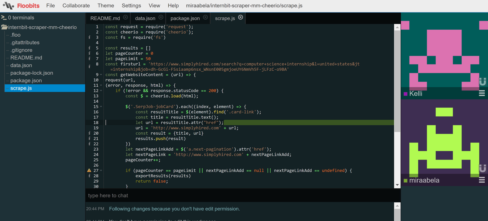

Pair programming can be an adventure! Having another set of eyes is always useful when you’re trying to figure out a particularly difficult section of code. However, there are so many different ways to pair program, from just screensharing and voice chatting with another person, to using more active plugins such as CodeTogether and Floobits so you can actively code with other people. Throughout this week, I had the chance to try pair programming with my teammates using all three methods!

## Discord Pair Programming with Jenny

During my pair programming session with Jenny, I mainly asked Jenny for advice on certain aspects of web scraping, such as writing to a .json file and navigating to other pages with the web scraper. In addition, my wifi connection was going in and out, so we decided to use Discord so Jenny could screenshare her code while I was using my phone. I felt that for this purpose, this worked reasonably well as I could ask Jenny questions about specific parts of her code while working on my own program. In addition, you can post formatted code blocks in Discord as well, so Jenny could copy/paste segments that could be of use to me. 

In addition, I felt that by working this way, I learned more/understood the process of the code better. When working together on a coding project with a plugin like CodeTogether, sometimes it’s easy to lose track of changes that are being made to the project. In this case, since I had to work on my code just on my end, I was more active in asking about the parts of code suggested by Jenny that I didn’t understand or that I needed more clarification on. However, I can definitely see how it can be inconvenient for the other person working on the code, since it would have been hard for Jenny to tell me to place a code block in a certain part of my file.

Overall, I felt that this session was very productive! I learned a lot about XRay, which seems very similar to Osmosis in the way it uses css selectors, and received a lot of help from Jenny to write my results to file (as well as catching certain css selectors that I had trouble finding previously).

## Code(-ing)Together with Aubrie

I also tried a pair programming session with Aubrie. In this session, we decided to try exploring other scrapers, so we felt that using CodeTogether would work well for this situation. CodeTogether is easy to use, we just needed to download and install the plugin, and click on “Start Sharing” in the CodeTogether tab on the right side of IntelliJ. Since Aubrie had a file set up to try testing out SimpleCrawler, Aubrie shared her files with me - clicking on “Start Sharing” generates a URL that you can send to other people so that they can work on the code with you. Upon going to the URL, the interface is very similar to IntelliJ, just in a web browser instead of the IntelliJ client. 

Working together on code felt very smooth, there was no noticeable delay except that occasionally you would need to toggle a button called “Control & Code” to write something in the code - it appears that the browser client has two modes, “Follow Host,” where the user mainly spectates the person hosting the session, and “Control & Code,” where the user can actively code in the shared files. It was my first time using it, so there might be a deeper meaning for it, but I felt that it wasn’t necessary to have this toggle. Even if it would toggle automatically when I would try to code after being inactive for a few minutes, the slight delay/being unable to type anything for a few seconds would throw me off a little. However, besides this small inconvenience, I felt that it was a pretty good tool to use for pair programming. I initially thought that you would only be able to access one file at a time (and would need to start a new session to work on other files), but it actually gives you access to the entire project, which I thought was really convenient as we needed to constantly move between files.

Aubrie and I were able to check out a few crawlers/scrapers, such as SimpleCrawler and Tatooine, but weren’t able to make too much progress since they were both completely new to us. However, I felt that we were able to get a decent feel for both crawlers in the time that we had for this pair programming session.

## Floobit-ing with Mirabela

For my final pair programming session, Mirabela and I decided to try out Floobits. Floobits works very similarly to CodeTogether, as you download it as a plugin to try in IntelliJ and can open up a workspace to share with another person within a browser. Mirabela and I both noticed that the interface of Floobits was very intuitive, I particularly remember her mentioning how she didn’t even notice that she was working on her code in her browser instead of in the IntelliJ client. 

I also thought it was pretty cool that Floobits would follow the host whenever they would scroll to a particular section of their code. I think this feature would be particularly useful for code reviews, since you would be able to follow the host and know exactly what section of the code they’re talking about. In addition, unlike CodeTogether, users can code simultaneously in Floobits without needing to toggle who can edit. It seems that Floobits has great potential for utility in both code reviews and code collaboration.

During this session, Mirabela and I mainly reviewed our code with each other. I got a lot of useful resources from her, such as an Xpath <a href="https://devhints.io/xpath">cheatsheet</a> and some hints on how to possibly deal with pagination! I also learned a decent amount about Cheerio and how she used recursion to gather results from all the pages in a website. Overall, I felt that this was a pretty informative session and I got to learn a lot about her process for web scraping.

## Pair Programming: Two Brains Are Better Than One

In conclusion, I felt that this was a very good experience to work on code with other team members! Because we were all working on different libraries, I felt that at the current moment, pair programming sessions were mainly better for code reviews. However, whenever we start working using the same/similar libraries, I’m sure that the tools we’ve been using - such as Floobits and CodeTogether - will be very useful for code collaboration. 
