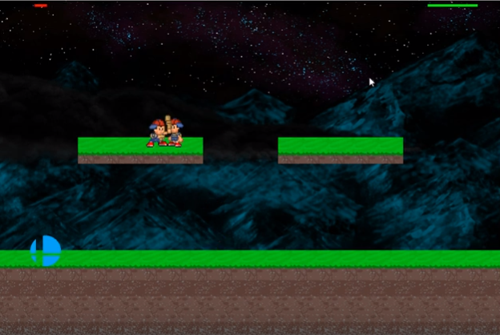

This 2D Fighter Game was my final project for ICS 111, where we needed to create a game that demonstrated our knowledge of programming - such as for/while loops, conditionals, functions, etc - from this semester. In this project, I worked with two other students to create a fighting game akin to the likes of Super Smash Bros using EZ Library in Java.

This is a two-player game, where players have different controls on the keyboard. One player uses the keys “a” and “d” to move, “q” to attack, and space to jump, while the other player uses “j” and “l” to move, “u” to attack, and “m” to jump. Each player's health is displayed at the top left/right of the screen. The players attack each other until one player has no health. There are powerups that randomly spawn on the ground - if a player obtains a powerup, their damage increases. After one player wins by decreasing the other player's health to zero, players can play again by clicking the refresh button.

In this project, I mainly worked on the movements of the player and helped to pinpoint the hitbox of the players and the players’ weapons. Overall, this project was a great experience in coding with a team, especially regarding division of work and time management. In particular, it was important to learn how to plan ahead, since some snippets of the game could not be coded until other functions were finished.

Check out a video of this game in action <a href="https://www.youtube.com/watch?v=-w64P45hA1E">here</a>.
