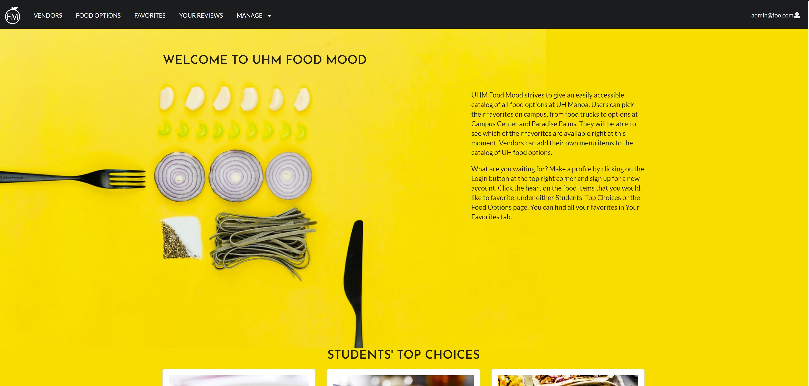

UHM Food Mood was a website application I developed my team and I developed as our final project for ICS 314, Software Engineering I. UHM Food Mood is a website that consolidates food options at UH Manoa so that students can easily see what food is available now and if their favorite foods are available now. UHM Food Mood does this by allowing users to browse through food options and "favorite" them by clicking on a heart button. From there, users can easily access their favorites through their "Your Favorites" page and see which ones are available by clicking on the "Food Available Now" button. In addition, users are also able to review food options and give a score between 1 - 5 (1 being the lowest and 5 being the highest). The average of the ratings for each food option will appear on the food option card. Users can also sort by highest rating by clicking the "Sort by Rating" button.

For this project, I contributed towards both both the front-end and back-end, as I worked on designing the user interface as well as working on the actual functionality of the website. In regards to the user interface, I, along with my teammate Mike, helped model the initial mockup pages for the website and made the decision to use <a href="https://react.semantic-ui.com/views/card/">Cards</a> as the basis for the food options/favorites. In addition, I also worked extensively to craft the functionality of the website, from creating the MongoDB collections for food options, favorites, and reviews, to creating pages that worked with these collections to provide actual utility to the website. I would say my main contribution in this regard was the basic functionality of adding reviews, adding favorites, and the sort by rating/availability function of the food options. 

Overall, this project was a great learning opportunity to gain more experience with user interface design and databases. In regards to the user interface, I found that it was especially difficult to create a website with a naturally intuitive design, making constant user testing a necessity. Many times, I realized I had gotten too used to looking at the website and started overlooking possible design errors, like the lack of instructions for the search bar or colors that made parts of the website difficult to view. As such, this project really helped me gain a good understanding of why user testing is so important and how to address the issues that come up from user testing. In regards to databases, I came into this project with practically no experience working with databases, so this gave me a a good opportunity to learn about the basics and how it could be applied towards web development. In particular, it was fascinating to see how various collections within a Mongo DB database can connect to each other, as was the case with the Favorites and MenuItems collection. While it was tricky getting each item to connect to the correct item within each database, it was rewarding to see the functionality we could implement thereafter.

See our Organization GitHub homepage <a href="https://uhm-food-mood.github.io/">here</a> and UHM Food Mood source code <a href="https://github.com/uhm-food-mood/uhm-food-mood">here</a>.
