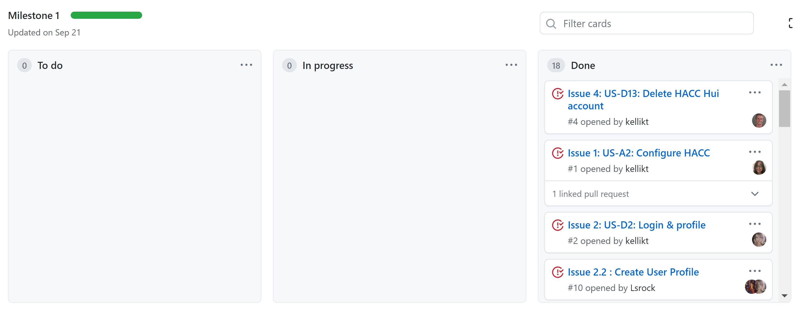

HACC-ing Our Way Through the Semester
## What was HACC-Hui?

<a href="https://hacc-hui.github.io/">HACC-Hui</a> was a website built using React and Meteor for the 2020 Hawaii Annual Code Competition to help participants find members for their HACC teams. It was also our main project for ICS 414. At the beginning of the semester, we were initially split up into groups and worked on different versions of the website that fulfilled each milestone. We would discuss our different versions in class and then aspects of each website version were put into the main site. Near the time that HACC registration started, we changed our process and we all started working on the same version of the site. Overall, it seems like the project was a success and that teams were able to use HACC-Hui to find new team members!

## HACC Functionality

I added a bit of functionality to HACC-Hui. I mainly worked on the overall configuration of HACC,  the Interested Participants page, the All Participants page, and the Team Invitations page. For the overall configuration of HACC, I created an admin page where admins would be able to set the names of challenges, the “skills” that users can select, and the “tools” that users can select. This was one of my main responsibilities while working on Milestone 1 with my initial team. While setting up the initial UI for this page was fairly straightforward, working with the collections was a bit more difficult, specifically for the challenges collection. The main issue I had with the challenges collection was that it was actually composed of two different collections. One was the general challenge collection (ChallengeCollection), which contained information like the title, description, and pitch. The other was a collection that had the interests associated with each challenge (ChallengeInterestCollection). Since we would have to pair each challenge/interest together for each new challenge / whenever a challenge was edited, it was a little tricky to match the challenge and interest every time. Luckily, I was able to get it to work by using loops to match (or create) the ChallengeCollection to the ChallengeInterestCollection.

Links to associated GitHub pages:

<a href="https://github.com/400-iq/HACC-Hui/blob/milestone-1/app/imports/ui/pages/AddChallenge.jsx">AddChallenge</a>

<a href="https://github.com/400-iq/HACC-Hui/blob/milestone-1/app/imports/ui/pages/AddSkill.jsx">AddSkill</a>

<a href="https://github.com/400-iq/HACC-Hui/blob/milestone-1/app/imports/ui/pages/AddTool.jsx">AddTool</a>

<a href="https://github.com/400-iq/HACC-Hui/blob/milestone-1/app/imports/ui/pages/EditChallenge.jsx">EditChallenge</a>

<a href="https://github.com/400-iq/HACC-Hui/blob/milestone-1/app/imports/ui/pages/EditSkill.jsx">EditSkill</a>

<a href="https://github.com/400-iq/HACC-Hui/blob/milestone-1/app/imports/ui/pages/EditTool.jsx">EditTool</a>

<a href="https://github.com/400-iq/HACC-Hui/blob/milestone-1/app/imports/ui/pages/ManageHACC.jsx">ManageHACC</a>

<a href="https://github.com/400-iq/HACC-Hui/blob/milestone-1/app/imports/ui/components/ChallengeAdminTable.js">ChallengeAdminTable</a>

<a href="https://github.com/400-iq/HACC-Hui/blob/milestone-1/app/imports/ui/components/SkillAdminTable.js">SkillAdminTable</a>

<a href="https://github.com/400-iq/HACC-Hui/blob/milestone-1/app/imports/ui/components/ToolAdminTable.js">ToolAdminTable</a>

<a href="https://github.com/400-iq/HACC-Hui/projects/1">M1 Project Board</a>

For Milestone 2, my main responsibility was to create a way for participants to show interest in joining a team. This mainly involved creating a page for team owners to see those who were interested in the team and implementing Slack DM functionality. I also added a button (“Request to Join”) for participants to show interest in joining a team within a team finder that a member of my team, Jenny, created. This button would be the “trigger” for the participant to show up on the Interested Participants page for team owners. For the Interested Participants page, I decided to organize the interested participants based on teams, since participants could own more than one team. On this page, team owners were able to accept or decline the participant, upon accepting, the participant was added to the team. In addition, I was also able to integrate Slack functionality for participants to notify team owners regarding their interest in joining. Once a participant clicked on the “Request to Join” button, a Slack DM would be sent to the team owners notifying them of the participant’s request to join. This was initially a bit tricky, as Slack DMs could only be sent on the server side. However, Dr. Moore was able to code some Cron Jobs that would check every few minutes for a request to join, and then use the server side Slack DM function to notify the team owners on Slack. 

Links to associated GitHub pages:

<a href="https://github.com/400-iq/HACC-Hui/blob/issue-8/app/imports/ui/pages/developer/InterestedDevelopers.jsx">InterestedParticipants (InterestedDevelopers)</a>

<a href="https://github.com/400-iq/HACC-Hui/blob/issue-8/app/imports/ui/components/InterestedDeveloperCard.jsx">InterestedParticipantsCard (InterestedDevelopersCard)</a>

<a href="https://github.com/400-iq/HACC-Hui/blob/master/app/imports/startup/server/CronJobs.js">CronJobs</a>

<a href="https://github.com/400-iq/HACC-Hui/projects/2">M2 Project Board</a>

For Milestone 3, I worked on allowing team owners to issue invitations to participants to join their team, along with Slack DM functionality. When the entire class began working on the same version of HACC-Hui, I carried this functionality to that version as well. To give team owners the ability to issue team invitations, I had to create a page for participants to view all participants (All Participants page) and a page for participants to view their team invitations from team owners (Team Invitations page). The All Participants page was similar to the Team Finder page that Jenny created in the previous milestone, but would show various information about the participant, such as their skills, challenges, and tools. Team owners were also able to issue team invitations from this page as well. On the Team Invitations page, participants would be able to accept or reject invitations. Upon accepting the invitation, the participant would be added to the team. 

In addition, I also added Slack DM functionality. Similar to the previous Slack functionality in the last milestone, we made use of the Cron Jobs from Dr. Moore. These jobs would check for a team invitation, and then use the server side Slack DM function to notify the participant.

Links to associated GitHub pages:

<a href="https://github.com/HACC-Hui/HACC-Hui/blob/master/app/imports/ui/components/participant/ListParticipantsCard.jsx">ListParticipantsCard</a>

<a href="https://github.com/HACC-Hui/HACC-Hui/blob/master/app/imports/ui/components/participant/ListParticipantsWidget.jsx">ListParticipantsWidget</a>

<a href="https://github.com/HACC-Hui/HACC-Hui/blob/master/app/imports/ui/components/participant/ListParticipantsFilter.js">ListParticipantsFilter</a>

<a href="https://github.com/HACC-Hui/HACC-Hui/tree/master/app/imports/ui/pages/participant">ListParticipantsPage</a>

<a href="https://github.com/HACC-Hui/HACC-Hui/blob/master/app/imports/ui/components/participant/TeamInvitationCard.jsx">TeamInvitationCard</a>

<a href="https://github.com/HACC-Hui/HACC-Hui/blob/master/app/imports/ui/components/participant/TeamInvitationsWidget.jsx">TeamInvitationWidget</a>

<a href="https://github.com/HACC-Hui/HACC-Hui/blob/master/app/imports/ui/pages/participant/TeamInvitationsPage.jsx">TeamInvitationsPage</a>

<a href="https://github.com/HACC-Hui/HACC-Hui/blob/master/app/imports/startup/server/CronJobs.js">CronJobs</a>

<a href="https://github.com/400-iq/HACC-Hui/projects/3">M3 Project Board</a>

## Teaming Up

In the beginning of the semester, I worked with a few teammates - Jenny, Lucy, and James. We would split up the work by first creating a project board with all of the issues for the milestone. Then we would choose 1-2 “big” issues each, and create smaller issues that would correspond to those big issues. I felt like this system worked out pretty well, as we would all get to choose issues that we wanted to work on, and the work was distributed relatively equally. As mentioned previously, for the first milestone, I worked on the overall configuration of HACC, for the second milestone, I worked on the Interested Participants page (and its associated Slack functionality), and for the third milestone, I worked on the Team Invitations and List all Participants pages (and their associated Slack functionality).

Overall, I felt like my team was pretty good this semester. We scheduled meetings biweekly, on Mondays and Wednesdays, so we would be able to review our work before class on Tuesdays and Thursdays. Besides being able to split up the work amongst other people, it was helpful to have teammates to bounce off ideas of and talk to if we ran into issues. In the beginning, I was having difficulty running HACC-Hui on my laptop, but was able to troubleshoot after talking to my teammates. I’m glad I got to work with everyone and love how we were able to bring our project together!

##  The ICS 414 Experience
ICS 414 this year was a pretty interesting experience, especially since classes were held on a Discord server. I honestly liked using Discord more than the combination of Slack + Zoom that was considered for this course previously. With Discord, we were able to have all our meetings in one place, and were also able to have individual chats/voice channels for our groups. I also found it useful that resources/announcements were readily available within the server. Since I use Discord for personal use as well, I would be able to quickly see if there was anything I needed to address. Another thing that I felt went well was the organization of the deadlines/issues for the milestones - I thought that the issues outlined clearly what we needed to complete and I found them very useful as I worked on HACC-Hui. 

One minor complaint I have about the course was just the organization of the last part of the semester, where we switched from working on the website in small groups to working on it with all the students. I understand that it couldn’t be helped since registration was so close for HACC-Hui, but it did feel a little less organized when we suddenly started working with the entire class as a whole.

However, I definitely felt like I learned a lot throughout this semester! I especially learned a lot of different aspects of Meteor/React, such as working with collections and how you can intermix Cron Jobs to automate things like Slack messaging. It was also interesting to see the work process of working on a project with a large group. It really did feel a bit different creating a project for an actual client with a real purpose/function - and I’m glad that I was able to contribute towards HACC-Hui! 
