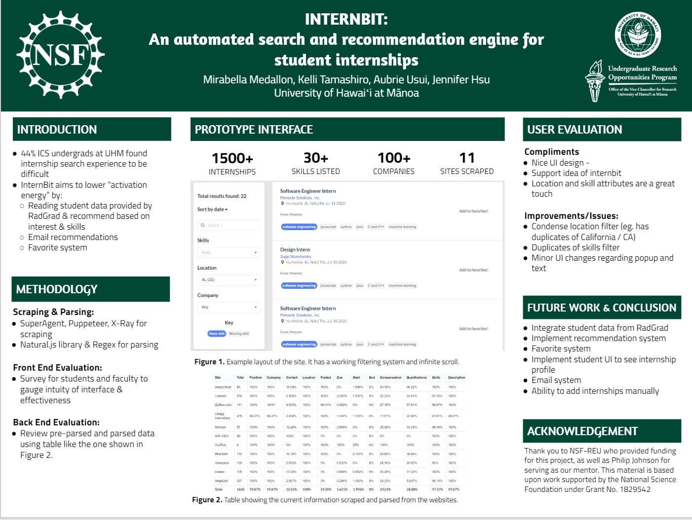

## Internship for internships, interns for interns
InternBit was an internship recommendation system that I worked on during my RadGrad internship in Summer 2020. InternBit attempts to provide a service to both ICS undergraduate students and ICS faculty members by improving the internship search process and providing valuable information about whether the ICS program prepares students to obtain internships. InternBit scrapes internship listings from various internship sites, such as LinkedIn, Glassdoor, and Indeed. It uses a few web scraping tools, such as Superagent and Puppeteer to make API calls and scrape listings from these sites. Then, it uses a parser using the Natural.js library (natural language processing) to parse through the scraped data to find additional data, such as skills, location, compensation, and contact information. The parsed data is then loaded onto prototype user interfaces created using React and Javascript. Within these prototype user interfaces, users can find internships by filtering through different categories, such as needed skills and location.

For this project, I worked on web scraping, parsing the data, and creating a prototype user interface. In regards to web scraping, I initially used the web scraping tool Osmosis to scrape internship listings from SimplyHired and WayUp. However, I ended up switching to Puppeteer to scrape listings from Idealist and Student Opportunity Center, as Osmosis was unable to scrape from Idealist and Student Opportunity Center required a login. In regards to parsing the data, I parsed soft skills from the scraped data using the Natural.js library and later used RegEx to parse contact information, such as phone number and email address, from the scraped data. I also created a prototype user interface to display the parsed data using React and Javascript. 

I felt like I learned a lot from this project. This was my first time working with web scrapers and natural language processing, so I learned a lot about the process of scraping and parsing web data. It was especially interesting to work with Puppeteer, as I was able to automate logging in and searching a particular query on internship sites such as Student Opportunity Center. In addition, I had the chance to delve deeper into front-end development when I created my prototype user interface. I was able to learn how to utilize pagination and filters for the internship listings, which granted more convenience for users to look through the listings. 

## Collaborative coding is the best type of coding

I also learned a lot about working together with my peers, which was an interesting experience working remotely. I got to use a few pair programming tools such as Floobits and CodeTogether so that I could collaborate with my team in real-time. These programming tools acted similarly to other digital real-time collaboration tools, like Google Docs, where we could both edit code at the same time. I found this especially useful when I was first <a href="https://kellikt.github.io/essays/two-brains.html"> learning how to use web scrapers</a>. Having another person to check over your code is like a pair of fresh eyes, and is certainly something that I would like to do more often in the future!

In addition, I had the opportunity to prepare and present a research poster with my InternBit team for the Summer 2020 Student Undergraduate Research Program Conference. While it was held remotely due to COVID-19, it was still an amazing opportunity to both share research and learn from other students. 

Overall, InternBit was a great experience to both practice the web development skills I learned from my previous ICS courses and collaborate with my peers to create a working prototype for an internship recommendation system. 

Read more about InternBit <a href="https://www.radgrad.org/docs/archive/internbit/goals">here.</a>
